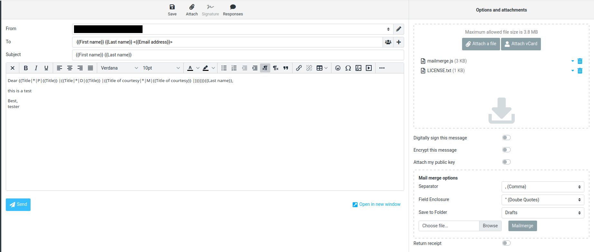

# Roundcube Mailmerge

Generate Mass-e-mails from Template and CSV with Roundcube.

Inspired by: https://addons.thunderbird.net/en-US/thunderbird/addon/mail-merge/

## Supported Variable replacements
`{{name}}`
The variable will be replaced by the value of the field name, e.g.:
`{{FirstName}}`: the variable will be replaced by the value of the field FirstName
`{{LastName}}`: the variable will be replaced by the value of the field LastName
`{{PrimaryEmail}}`: the variable will be replaced by the value of the field PrimaryEmail

**The first row of the CSV will always be the table header determining the column names!**

`{{name|if|then}}`
If the value of the field name equals if, then the variable will be replaced by then.

`{{name|if|then|else}}`
If the value of the field name equals if, then the variable will be replaced by then, else by else.

`{{name|*|if|then|else}}` (includes)
If the value of the field name includes if, then the variable will be replaced by then, else by else.

`{{name|^|if|then|else}}` (starts with)
If the value of the field name starts with if, then the variable will be replaced by then, else by else.

`{{name|$|if|then|else}}` (ends with)
If the value of the field name ends with if, then the variable will be replaced by then, else by else.

`{{name|==|if|then|else}}` (equal to) (number)
If the value of the field name is equal to if, then the variable will be replaced by then, else by else.

`{{name|>|if|then|else}}` (greater than) (number)
If the value of the field name is greater than if, then the variable will be replaced by then, else by else.

`{{name|>=|if|then|else}}` (greater than or equal to) (number)
If the value of the field name is greater than or equal to if, then the variable will be replaced by then, else by else.

`{{name|<|if|then|else}}` (less than) (number)
If the value of the field name is less than if, then the variable will be replaced by then, else by else.

`{{name|<=|if|then|else}}` (less than or equal to) (number)
If the value of the field name is less than or equal to if, then the variable will be replaced by then, else by else.